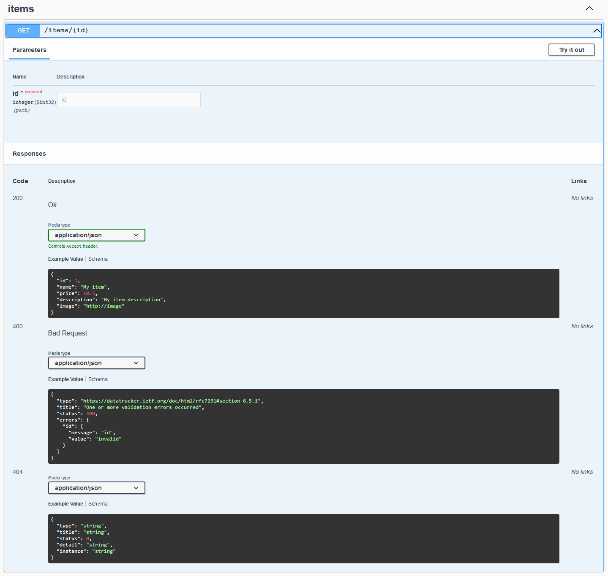

# Kubernetes Node API

This guide is intended to demonstrate how to build a REST API using node, including:

- typescript
- linting
- testing
- express
- swagger
- docker
- kubernetes
- helm

It is split up into the following sections:

1. [Setting up the project](#setting-up-the-project)
2. [Adding swagger](#adding-swagger)
3. [Adding docker](#adding-docker)
4. [Deploying to kubernetes](#deploying-to-kubernetes)

## Prerequisites

- node 16
- docker
- a local kubernetes cluster (the version included with Docker Desktop was used when writing this guide)
- kubectl (already installed if using kubernetes in Docker Desktop)
- helm
- vscode

# Setting up the project

Create a new folder:

```
mkdir k8s-node-api
cd k8s-node-api
```

Initialise a new node project:

```
npm init -y
```

Install typescript & node types:

```
npm i -D typescript @types/node
```

Initialise typescript:

```
npx tsc --init
```

Install a base tsconfig:

```
npm i -D @tsconfig/node16
```

Replace the content of `tsconfig.json` with:

```
{
  "extends": "@tsconfig/node16/tsconfig.json",
  "compilerOptions": {
    "outDir": "./build"
  },
  "include": [
    "src/**/*"
  ],
  "exclude": [
    "node_modules",
    "**/*.test.ts"
  ]
}
```

## Adding express

Install express:

```
npm i express
```

Install type definitions:

```
npm i -D @types/express
```

Create a new file called `src/app.ts` with the following content:

```
import express from "express";

export default function createApp() {
  const app = express();
  app.use(express.json());

  return app;
}
```

Create a new file called `src/index.ts` with the following content:

```
import createApp from "./app";

const port = 3000;
const app = createApp();

app.listen(port, () => {
  console.log(`Listening on port ${port}`);
});
```

## Adding linting

Install eslint:

```
npm i -D eslint @typescript-eslint/parser @typescript-eslint/eslint-plugin
```

Add a new file called `.eslintrc.js` with the following content:

```
module.exports = {
  root: true,
  parser: "@typescript-eslint/parser",
  plugins: ["@typescript-eslint"],
  extends: ["eslint:recommended", "plugin:@typescript-eslint/recommended"],
};
```

Add a new file called `.eslintignore` with the following content:

```
node_modules
build
```

Add a lint command to `package.json`:

```
"scripts": {
  "lint": "eslint . --ext ts"
},
```

Try out the lint command (to see it report an error try adding an unused constant to `src/app.ts`):

```
npm run lint
```

## Adding testing

Install jest:

```
npm i -D jest ts-jest @types/jest
```

Configure jest:

```
npx ts-jest config:init
```

Add a test command to `package.json`:

```
"scripts": {
  "test": "jest"
},
```

Install supertest:

```
npm i -D supertest @types/supertest
```

Create a new file called `src/app.test.ts` with the following content:

```
import request from "supertest";
import createApp from "./app";

const app = createApp();

it("returns 404 for unknown route", async () => {
  await request(app).get("/unknown").expect(404);
});
```

Try out the test command:

```
npm test
```

## Adding a basic endpoint

Add a test for the new endpoint in `src/app.test.ts`:

```
it("/health returns 200", async () => {
  await request(app).get("/health").expect(200);
});
```

Add the new endpoint in `src/app.ts`:

```
import express, { Request, Response } from "express";

export default function createApp() {
  const app = express();
  app.use(express.json());

  app.get("/health", (req: Request, res: Response) => {
    res.status(200).send("Healthy");
  });

  return app;
}
```

## Running without docker

This section is only relevant if you want to be able to run the API locally without docker

Install ts-node-dev:

```
npm i -D ts-node-dev
```

Add a dev command to `package.json`:

```
"scripts": {
  "dev": "ts-node-dev --respawn --pretty --transpile-only src/index.ts"
},
```

Try out the dev command:

```
npm run dev
```

Call the API (this should return "Healthy"):

```
curl http://localhost:3000/health
```

Stop the process with Ctrl+C

# Adding swagger

To enable swagger install tsoa and swagger-ui-express:

```
npm i tsoa swagger-ui-express
npm i -D @types/swagger-ui-express
```

Enable experimentalDecorators & emitDecoratorMetadata in `tsconfig.json`:

```
"compilerOptions": {
  "outDir": "./build",
  "experimentalDecorators": true,
  "emitDecoratorMetadata": true
},
```

Add a new file called `tsoa.json` with the following content:

```
{
  "entryFile": "src/index.ts",
  "noImplicitAdditionalProperties": "throw-on-extras",
  "controllerPathGlobs": ["src/**/*controller.ts"],
  "spec": {
    "outputDirectory": "public",
    "specVersion": 3
  },
  "routes": {
    "routesDir": "src"
  }
}
```

Take note of `controllerPathGlobs` in the above configuration. It tells tsoa where to find the controllers with which to generate the swagger json. It will also automatically generate the express routes, instead of us manually defining them as we've done so far.

To demonstrate this we'll add a controller with a single endpoint for getting menu items by ID. Interacting with a real database is beyond the scope of this guide so it will use a simple in-memory implementation. We'll use several tsoa features to enrich the swagger. Add the following files.

`src/items/items.controller.ts`:

```
import { Controller, Get, Path, Response, Route, Tags } from "tsoa";
import * as ItemService from "./items.service";
import { Item } from "./items.types";

@Route("items")
@Tags("items")
export class ItemsController extends Controller {
  /**
   * @isInt id
   */
  @Get("{id}")
  @Response(400, "Bad Request")
  @Response(404, "Not Found")
  public async getItem(@Path() id: number) {
    const item: Item = await ItemService.find(id);

    if (item) {
      return item;
    }

    this.setStatus(404);
  }
}
```

`src/items/items.service.ts`:

```
import { Item, Items } from "./items.types";

const items: Items = {
  1: {
    id: 1,
    name: "Burger",
    price: 599,
    description: "Tasty",
    image: "https://cdn.auth0.com/blog/whatabyte/burger-sm.png",
  },
  2: {
    id: 2,
    name: "Pizza",
    price: 299,
    description: "Cheesy",
    image: "https://cdn.auth0.com/blog/whatabyte/pizza-sm.png",
  },
  3: {
    id: 3,
    name: "Tea",
    price: 199,
    description: "Informative",
    image: "https://cdn.auth0.com/blog/whatabyte/tea-sm.png",
  },
};

export const find = async (id: number): Promise<Item> => items[id];
```

`src/items/items.types.ts`:

```
/**
 * @tsoaModel
 * @example
 * {
 *   "id": 1,
 *   "name": "My item",
 *   "price": 10.5,
 *   "description": "My item description",
 *   "image": "http://image"
 * }
 */
export interface Item {
  /**
   * @isInt
   */
  id: number;
  name: string;
  price: number;
  description: string;
  image: string;
}

export interface Items {
  [key: number]: Item;
}
```

Add these commands to `package.json`:

```
"scripts": {
  "predev": "npm run swagger",
  "prebuild": "npm run swagger",
  "swagger": "tsoa spec-and-routes"
},
```

Run the swagger command:

```
npm run swagger
```

This will generate two files:

- `public/swagger.json`
- `src/routes.ts`

Modify `src/app.ts` as follows:

```
import express, { Request, Response } from "express";
import swaggerUi from "swagger-ui-express";
import { RegisterRoutes } from "./routes";

export default function createApp() {
  const app = express();
  app.use(express.json());
  app.use(express.static("public"));

  app.get("/health", (req: Request, res: Response) => {
    res.status(200).send("Healthy");
  });

  app.use(
    "/swagger",
    swaggerUi.serve,
    swaggerUi.setup(undefined, {
      swaggerOptions: {
        url: "/swagger.json",
      },
    })
  );

  RegisterRoutes(app);

  return app;
}
```

Run the API:

```
npm run dev
```

Navigate to `http://localhost:3000/swagger` in a browser to see the swagger page:



# Adding docker

Add a build command to `package.json`:

```
"scripts": {
  "build": "tsc"
},
```

Try out the build command:

```
npm run build
```

Create a new file called `Dockerfile` with the following content:

```
FROM node:16-alpine as builder
WORKDIR /usr/src/app
COPY package*.json ./
RUN npm ci
COPY tsconfig.json tsoa.json ./
COPY src src
RUN npm run build

FROM node:16-alpine
ENV NODE_ENV=production
WORKDIR /usr/src/app
COPY --from=builder /usr/src/app/package*.json ./
RUN npm ci --only=production && npm cache clean --force
COPY --from=builder /usr/src/app/build build/
COPY --from=builder /usr/src/app/public public/
EXPOSE 3000
CMD [ "node", "./build/index.js" ]
```

This is a multi-stage dockerfile with the goal of minimising the size of the image

Create a new file called `.dockerignore` with the following content:

```
node_modules
npm-debug.log
```

Build the image:

```
docker build -t k8s-node-api .
```

Run the image:

```
docker run -dp 3000:3000 k8s-node-api
```

Call the API (this should return "Healthy"):

```
curl http://localhost:3000/health
```

Stop the container:

```
docker stop {container_id}
```

You can get the container ID with:

```
docker ps
```

When you're finished, clear up the resources that were created:

```
docker system prune
```

## Docker Compose

Docker Compose is a tool for defining and running multi-container Docker applications. However it can still be useful for single-container applications, in that it simplifies the build/run commands.

Add a new file called `docker-compose.yaml` with the following content:

```
version: "3.9"
services:
  api:
    build: .
    ports:
      - "3000:3000"
```

Build and run the image:

```
docker-compose build
docker-compose up
```

Call the API (this should return "Healthy"):

```
curl http://localhost:3000/health
```

Press Ctrl+C to stop the container

When you're finished, clear up the resources that were created:

```
docker system prune
```

# Deploying to kubernetes

The intention is to eventually use helm to deploy to kubernetes but it's informative (and simpler) to do so without helm at least once.

Create a new folder:

```
mkdir -p deployment/k8s
cd deployment/k8s
```

Add a new file called `k8s-node-api.yaml` with the following content:

```
apiVersion: apps/v1
kind: Deployment
metadata:
  name: k8s-node-api
  namespace: default
spec:
  replicas: 1
  selector:
    matchLabels:
      app: k8s-node-api
  template:
    metadata:
      labels:
        app: k8s-node-api
    spec:
      containers:
        - name: k8s-node-api
          image: k8s-node-api:latest
          imagePullPolicy: IfNotPresent
---
apiVersion: v1
kind: Service
metadata:
  name: k8s-node-api
  namespace: default
spec:
  type: NodePort
  selector:
    app: k8s-node-api
  ports:
    - port: 3000
      targetPort: 3000
      nodePort: 30001

```

Deploy to kubernetes:

```
kubectl apply -f k8s-node-api.yaml
```

Check the status of the deployment:

```
kubectl get deployments
```

You should see something like this:

```
NAME           READY   UP-TO-DATE   AVAILABLE   AGE
k8s-node-api   1/1     1            1           3s
```

Call the API (this should return "Healthy"):

```
curl http://localhost:30001/health
```

When you're finished, clear up the resources that were created:

```
kubectl delete -f k8s-node-api.yaml
```

## Adding a helm chart

Create a new folder for helm (assuming you followed the previous section you will currently be in `deployment/k8s`):

```
cd ..
mkdir helm
cd helm
```

Create the helm chart:

```
helm create k8s-node-api
```

This generates quite a few files, most of which we're going to delete to keep things simple:

1. delete the `charts` folder
2. delete the contents of the `templates` folder
3. delete the contents of the `values.yaml` file

Replace the contents of `Chart.yaml` with:

```
apiVersion: v2
name: k8s-node-api
description: A Helm chart for k8s-node-api
type: application
version: 0.1.0
appVersion: "1.0.0"
```

Take what we put in `k8s-node-api.yaml` in the previous section and add it to the helm chart (this time in separate files)

Add a new file called `templates/deployment.yaml` with the following content:

```
apiVersion: apps/v1
kind: Deployment
metadata:
  name: k8s-node-api
  namespace: default
spec:
  replicas: 1
  selector:
    matchLabels:
      app: k8s-node-api
  template:
    metadata:
      labels:
        app: k8s-node-api
    spec:
      containers:
        - name: k8s-node-api
          image: k8s-node-api:latest
          imagePullPolicy: IfNotPresent
```

Add a new file called `templates/service.yaml` with the following content:

```
apiVersion: v1
kind: Service
metadata:
  name: k8s-node-api
  namespace: default
spec:
  type: NodePort
  selector:
    app: k8s-node-api
  ports:
    - port: 3000
      targetPort: 3000
      nodePort: 30001
```

Install the helm chart:

```
helm upgrade --install k8s-node-api k8s-node-api/
```

Check the status of the deployment:

```
kubectl get deployments
```

You should see something like this:

```
NAME           READY   UP-TO-DATE   AVAILABLE   AGE
k8s-node-api   1/1     1            1           3s
```

Call the API (this should return "Healthy"):

```
curl http://localhost:30001/health
```

Helm charts can be made more flexible by allowing values to be passed in at install time

Add the following to `values.yaml`:

```
image:
  tag: "latest"
```

In `templates/deployment.yaml`, replace:

```
image: k8s-node-api:latest
```

with:

```
image: k8s-node-api:{{ .Values.image.tag }}
```

This allows you to override the image tag:

```
helm upgrade --install --set image.tag=mytag k8s-node-api k8s-node-api/
```

When you're finished, clear up the resources that were created:

```
helm uninstall k8s-node-api
```

With this, the cycle to get a change into kubernetes is (from the repo root):

1. Make code change
2. Run `docker build -t k8s-node-api .`
3. Run `kubectl rollout restart deployment/k8s-node-api`
   - note: this is only suitable for local development - beyond that you would create an image with a new tag and run `helm upgrade`

# Troubleshooting

Open a shell in a running container (docker):

```
docker exec -it {container_name} //bin/sh
```

Open a shell in a running container (kubernetes):

```
kubectl exec --stdin --tty {pod_name} -- //bin/sh
```

# Future

This guide intentionally tried to keep things simple for the purpose of learning while still providing a decent foundation to build on. So naturally there's a lot more that could be done to make it production-ready:

- [express security best practices](https://expressjs.com/en/advanced/best-practice-security.html)
- [express performance best practices](https://expressjs.com/en/advanced/best-practice-performance.html)
- [kubernetes production best practices](https://learnk8s.io/production-best-practices)
- [helm chart best practices](https://helm.sh/docs/chart_best_practices)
